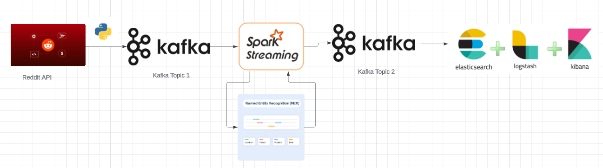

# NBA Data Streaming Using Spark Structured Streaming, Kafka, Reddit API

### Introduction
This project focuses on implementing a specified data processing workflow using the Reddit platform as the data source. We stream real-time comments from the 'nba' subreddit using PRAW (Python Reddit API Wrapper). The goal is to analyze these comments for named entity recognition, count occurrences, and visualize the data using a series of interconnected technologies.

### Architecture

### About Dataset/API
The data is sourced from Reddit, specifically the 'nba' subreddit, which provides a continuous stream of user comments. We use PRAW for its efficient 
access to Reddit’s API, enabling real-time data streaming.

###  System Configuration
We serialize incoming data into JSON and send it to a Kafka topic named 'topic1'. This approach ensures that our data pipeline is robust and prepared for high-volume data flows.

### Data Processing
Our PySpark application processes the stream from 'topic1'. It identifies and counts named entities within the comments, 
aligning with the task of understanding community focus within the NBA discussions.

### Data Transmission and Visualization 
We transfer the processed data to another Kafka topic, 'topic2'. From there, Logstash forwards this data to Elasticsearch, which we then visualize in Kibana as a bar plot of the most frequently mentioned named entities.

### Prerequisites
Ensure you have the following installed:
- Python 3.x
- Apache Kafka
- Apache Spark
- Elasticsearch and Kibana
- Logstash

Python Libraries:
- pyspark
- spacy
- pandas
- jupyter-notebook
- praw
- json

  ### Steps to run 
1. Start Zookeeper Service
Zookeeper is required to run Kafka. Open a terminal and execute:
bin/zookeeper-server-start.sh config/zookeeper.properties

2. Start Kafka Server
Open another terminal and start the Kafka server:
bin/kafka-server-start.sh config/server.properties

3. Stream Data from Reddit to Kafka
The reddit_to_kafka.py script streams data from the NBA subreddit to Kafka topic1. Run this script in a new terminal:
python reddit_to_kafka.py

4. Process Data with PySpark
First, create the spark_checkpoints folder in your working directory from where you will run the notebook file.
mkdir spark_checkpoints
Open the writer_topic2.ipynb in Jupyter Notebook to process the incoming data and write the named entity counts to Kafka topic2.
jupyter-notebook writer_topic2.ipynb

5. Start Elasticsearch
Run Elasticsearch from its bin directory:
bin/elasticsearch

6. Start Kibana
After starting Elasticsearch, run Kibana:
bin/kibana

7. Start Logstash
Use Logstash to pull data from Kafka topic2 into Elasticsearch. Use the provided logstash.conf file, however change the user name and password in the given logstash file to your credentials:
bin/logstash -f logstash.conf

8. Visualize Data with Kibana
Once Elasticsearch and Kibana are running, use Kibana to create visualizations for the data as needed.

